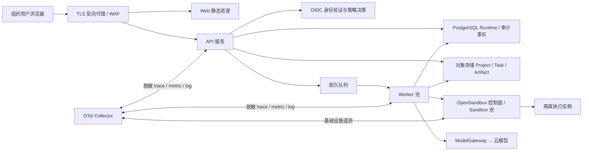

# Decision 003: Team deployment preparation

- Status: Proposed design; **not implemented and not approved for shared access**
- Date: 2026-08-15
- Affects plan: Phase 14

## 1. Purpose and non-goals

本文定义 DataHarness 从个人回环应用迁移到内部团队服务所需的稳定边界、迁移顺序和
安全 Gate。它是设计契约，不提供可运行的共享部署，不修改当前 API、Worker、Storage、
Sandbox 或 WebUI 的生产行为。

个人版仍是单机、单租户、`127.0.0.1`、SQLite、本机文件系统和当前会话环境变量。任何
人不得把本文件、`deployment/team/` 草案或本机 `start.ps1` 解释为已具备登录、多租户、
公网 TLS、HA、生产备份或合规认证。

## 2. Target topology and facts

| 边界 | 团队目标 | 当前个人版不可沿用的假设 |
|---|---|---|
| Edge | 只经 TLS 反向代理进入 API/Web；明确 Host、路径、大小和速率策略 | 回环地址即可信、浏览器与 API 同一用户 |
| 身份 | OIDC/OAuth 2.1 授权码 + PKCE；服务使用工作负载身份 | 本机进程环境和无登录 |
| 授权 | Project 绑定不可变 `tenant_id`，所有读写都先作 tenant/member/role 判定 | 仅凭 Project ID 即可访问 |
| 事实 | PostgreSQL 保存领域状态、事件、lease、审计；对象存储保存内容对象 | SQLite 与本地路径天然私有 |
| 执行 | Queue/Worker 只处理经授权的 `run_id`，按 lease epoch fencing | 单一 Worker、文件 marker 停止 |
| Sandbox | 每 Run 最小挂载、短期凭据、网络默认拒绝、独立资源配额 | 本机 Docker 与 loopback Sandbox Server |

领域事实源不变：Project/FileVersion/Snapshot、Task/Run/Step、Dataset/Artifact/Finding/Lineage
仍是持久化领域对象；自然语言摘要、WebUI 缓存、消息队列消息和 Sandbox 内存都不是事实源。

## 3. Threat model

| 威胁/攻击者 | 主要资产 | 强制控制 | 验收证据 |
|---|---|---|---|
| 未认证互联网客户端 | 所有 API/对象/事件 | Edge 仅允许 TLS、OIDC 验证、默认拒绝匿名、速率/请求体上限 | 未带 token、过期 token、错误 audience 均为 401；无 Ingress 前无法访问 |
| 已认证但跨租户成员 | Project、Task、Artifact、SSE | 每个 repository 查询和对象 key 都带 tenant scope；服务端不信任 URL 中 tenant/project ID | 跨租户枚举、下载、SSE 补发与资源引用均为 404/403 且无泄露差异 |
| 低权限团队成员 | 共享配置、成员、审计、删除能力 | RBAC + 最小权限；管理动作有审计事件且 require re-auth | viewer/editor/operator/admin 的正负权限矩阵 |
| 恶意文件、prompt 或模型输出 | Host、其他 Project、浏览器 | 原有 ModelGateway、Workspace、Sandbox、Chart 安全 Gate 保持；浏览器不执行生成脚本/HTML | 既有安全 E2E 加多租户 fixture |
| Sandbox 逃逸或控制面被盗用 | Host、对象存储、数据库、模型 Key | 不挂 Docker socket/数据库；每 Run 短期 scoped credential；NetworkPolicy/egress deny；attestation | mount、token audience、网络、namespace 负向测试 |
| Worker 重放/重复消费 | 发布对象、Run 状态 | `run_id + lease_epoch` fencing、幂等键、事务外发箱/outbox | 至少一次消息重复、延迟、旧 worker 回写测试 |
| 代理/浏览器攻击 | 会话、跨站写操作 | TLS/HSTS、Host allowlist、SameSite/HttpOnly/Secure cookie 或 bearer 策略、CSRF token、精确 CORS | Origin/CSRF/Host/header 测试 |
| 运维人员或日志平台 | PII、密钥、prompt、原始输出 | 外部 Secret Manager、字段脱敏、最小日志、审计不可篡改保留 | secret/PII 扫描、访问审计、日志抽样复核 |

高风险变更（新增 Ingress、租户字段、数据库、对象存储、Queue、身份提供商或 Sandbox
网络策略）必须分别通过设计评审、威胁建模和负向集成测试，不能用本阶段文档替代。

## 4. Identity, authorization and HTTP contract

1. Web 登录使用组织 OIDC 的 Authorization Code + PKCE；API 验证 issuer、audience、签名、
   expiry、nonce/回调状态。内部服务不得复用用户 bearer token，而使用 workload identity。
2. 角色暂定 `viewer`、`editor`、`operator`、`tenant_admin`、`platform_admin`。角色是租户
   成员关系，不是客户端可写字段；`platform_admin` 也需受审计的 break-glass 流程。
3. `tenant_id` 是 Project 创建时写入且不可变的领域范围。Task、Run、Step、Session、资源、
   事件与审计记录经 Project 继承 tenant，禁止从请求体重新指定或跨 Project 关联。
4. API 入口先构造不可伪造的 `RequestPrincipal(tenant_id, subject_id, roles, request_id)`，再将
   其传入授权服务；API DTO、Domain ID 和 WebUI 路由不添加本机 PID、路径或基础设施细节。
5. API 仅由反向代理公开；代理终结 TLS、启用 HSTS、限制 Host/方法/大小/超时，向后端以
   mTLS 或私网身份转发。不得信任客户端直传的 `X-Forwarded-*`。
6. Cookie 会话必须 `Secure`、`HttpOnly`、`SameSite=Lax/Strict` 并对所有状态变更校验 CSRF
   token；若采用 browser bearer token，则不使用 cookie 认证且严格限制 CORS。
7. CORS 只列出版本化的组织 Web Origin，禁止 `*`、反射 Origin、跨域 credential 和将 SSE
   作为认证旁路。SSE 继承同一 Principal、tenant 和资源授权。

## 5. Secret and key management

- API、Worker、Sandbox 控制面、对象存储和数据库使用独立 service account/secret scope；
  ModelGateway 的模型 Key 只能由 Worker 的受控凭据提供，绝不下发到浏览器、API DTO、
  Workspace、Sandbox、日志或镜像层。
- 使用组织 Secret Manager + workload identity，支持版本、轮换、撤销和访问审计。禁止把
  长期密钥放入 Compose、Kubernetes YAML、ConfigMap、Git、CI 输出或本机 `.toml`。
- Sandbox 仅获得当前 Run 必需且短时有效的对象前缀访问权；它永不获得 Runtime DB、Privacy
  DB、Docker socket、全局 bucket、模型凭据或队列凭据。
- 发生泄露时先撤销/轮换相应 scope、隔离受影响 Worker/Sandbox、保全脱敏审计，再根据
  Runtime 事实重试或终态处理 Run；禁止从日志重建秘密。

## 6. Compatibility seams and staged migrations

团队迁移保持下列调用者契约稳定；Phase 14 不修改代码。发现接口不够深时，后续阶段先提取
Protocol/Adapter 并补 Contract Test，再替换实现。

| 当前稳定边界 | 团队替换目标 | 迁移约束 |
|---|---|---|
| Domain ID、状态机、Snapshot、Evidence Gate | 保持不变 | tenant 范围由授权层/持久化约束补充，不能改变 ID 的不可变语义 |
| FastAPI DTO / OpenAPI / WebUI API client | 经 versioning 演进 | 认证上下文从 transport 注入，不把凭据、存储 key 或 worker 状态泄漏到 DTO |
| `VirtualWorkspace` / `PublicationJournal` | ObjectStorageWorkspace / PostgreSQL journal | 继续使用内容 hash、发布幂等键、staging→AVAILABLE 门控 |
| `SandboxProvider` | 共享 OpenSandbox control-plane Adapter | `SandboxSpec` 仍固定 ProjectSnapshot、Task、Run、digest、最小 mount 和资源限制 |
| `RunHandler` / `AgentRunHandler` | 保持单 Agent 装配 | 不引入多 Agent 或把队列消息当作上下文事实 |
| `LocalDurableExecutor` 的 lease/fencing 语义 | QueueWorkerExecutor + PostgreSQL lease | 至少一次投递不允许重复发布；旧 lease 永远不能提交 |

### 6.1 Runtime SQLite → PostgreSQL

1. 先为 repository/store 提取数据库无关的读写 Protocol 和 PostgreSQL Contract Test；保持
   事务、乐观版本、事件序号、幂等键与 lease epoch 语义。
2. 创建 PostgreSQL schema：所有可租户化表增加不可变 `tenant_id`，Project/Task/Run 的外键
   与唯一约束包含所属范围；启用行级安全或等价的服务端 scope 防御，不能只依赖应用过滤。
3. 离线导出 SQLite 一致快照，按 Project 生成 tenant 映射，导入 PostgreSQL；逐表核对行数、
   主键、版本、事件序列、hash、Snapshot 引用、发布状态与 checkpoint。
4. 灰度期以只读影子校验和双写 outbox 为主，不允许两个系统并行领取同一 Run。切换时停止
   新 claim、等待/终态化在途 lease、冻结写入、完成尾差校验后再切 Worker。
5. 回滚仅在未接受新 PostgreSQL 写入时切回旧只读快照；切换后需前向修复，不得把新 Run
   无审计地覆盖回 SQLite。

### 6.2 LocalWorkspace → Object storage

1. 先实现 `VirtualWorkspace` 的对象实现与本地/对象 Contract Test；对象 key 不暴露给 API
   或模型，格式为受控 tenant/project/task/resource ID + content hash，而非原始文件名。
2. 原始版本、提取物、Snapshot、working、staging、checkpoint、Dataset/Artifact 分别使用
   最小前缀策略；Bucket policy 防止跨 tenant/list，版本化与不可变保留保护输入和正式输出。
3. 大对象采用分段上传、服务端 hash/长度校验、临时 staging key 和原子发布标记；数据库
   中的 `AVAILABLE` 只能在对象存在且 hash 匹配后写入。
4. 迁移按 Project 分批复制并校验 manifest/hash，保留只读原 Workspace 直到抽样恢复、
   下载和 lineage 对账通过。Privacy SQLite 不迁入普通对象前缀，另行设计加密与生命周期。

### 6.3 单机 Worker → durable queue

1. Queue 消息只含 `run_id`、预期 `lease_epoch`、可追踪 correlation ID 和 schema version；
   不携带 prompt、模型 Key、文件路径、PII 或模型原文。
2. Worker 先在 PostgreSQL 事务中 claim/fence，再读取对象；消息至少一次、无序、延迟或重复
   都必须安全。使用 outbox 可靠投递，死信队列仅保存稳定错误分类和 ID。
3. 取消、预算、超时、Sandbox 丢失与重试仍由 Run 状态机和 lease 处理；队列 ack 不能替代
   Run 终态。worker autoscale 以队列深度、lease 年龄、Sandbox 可用量和配额共同决定。
4. 先运行 shadow consumer（只校验、绝不执行/发布），再按租户灰度一个 active consumer；
   迁移后保留 LocalDurableExecutor 作为受控回退 Adapter，不允许双 active worker。

## 7. Operations, capacity and recovery

- 配额维度：tenant、成员、Project、并发 Run、并发 Sandbox、CPU/内存/磁盘、对象字节、
  导入吞吐、模型 token/费用、队列 backlog 和请求速率。拒绝/等待必须写稳定 `wait_reason`
  和审计事件，不静默降级。
- Sandbox 池按 runtime digest、资源档位和租户配额分池；不跨 Run 复用可写 working/staging，
  空闲池只允许不含用户数据的基础环境。池耗尽时进入 WAITING/QUOTA，而非向 Host fallback。
- 可观测性使用 OTel 关联 `tenant_id`（经适当脱敏/散列）、request/task/run/step/sandbox ID；
  记录延迟、队列年龄、lease 冲突、重试、发布一致性、Sandbox 创建/销毁、对象失败和模型
  错误分类。禁止记录 prompt、原始模型输出、秘密、PII 或对象内容。
- 备份采用 PostgreSQL PITR、对象版本化/跨域复制、Secret Manager 恢复与审计日志保留。RPO、
  RTO、保留期和演练频率必须在容量基线测量后由平台与数据责任人批准；本阶段不虚构数值。
- 升级使用兼容 API/消息 schema、expand→migrate→contract 的数据库流程、canary Worker、
  Sandbox digest pin 和可回滚 Web 静态资源。灾难恢复必须演练 tenant 隔离、对象 hash、
  Snapshot、checkpoint、正式发布资源和审计链的一致性。

## 8. Pre-deployment security gates

以下全部完成前，禁止创建公网/组织共享 Ingress 或把草案标为可部署：

1. OIDC、RBAC、tenant scope、CSRF/CORS/TLS、Secret Manager、审计和速率限制均已实现并通过
   正负集成/E2E 测试。
2. PostgreSQL、对象存储、队列和共享 Sandbox Adapter 通过契约、迁移、故障、并发/fencing、
   备份恢复与容量测试。
3. 外部安全评审覆盖威胁模型、镜像/SBOM/漏洞、网络策略、最小权限、日志脱敏、渗透测试与
   事件响应；高风险项均有接受人和到期日。
4. Phase 13 的真实 Agent 链路、活跃 Run 恢复和 Docker-stop 验收已完成；本机应用仍可作为
   独立回归基线。

## 9. Draft deployment artifacts

`deployment/team/compose.draft.yaml` 和 `deployment/team/kubernetes.draft.yaml` 是结构草案：
它们刻意要求未提供的镜像/凭据、没有 Ingress、没有默认端口暴露，并标注 design-only。它们
用于审阅服务边界和配置清单，不能用于启动服务。
